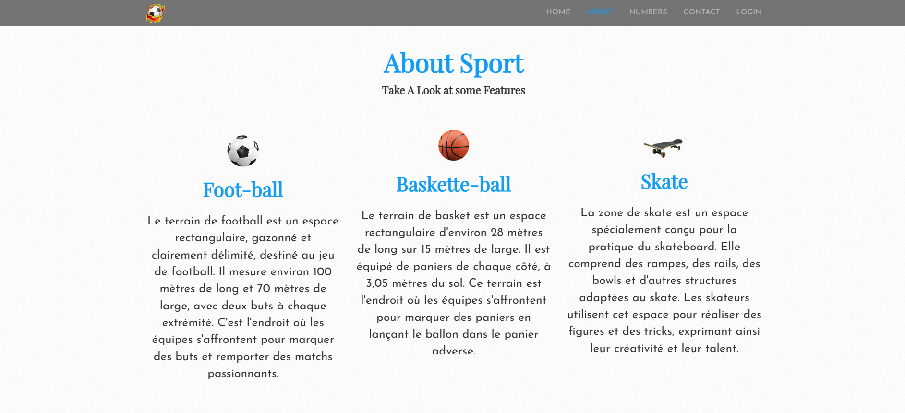
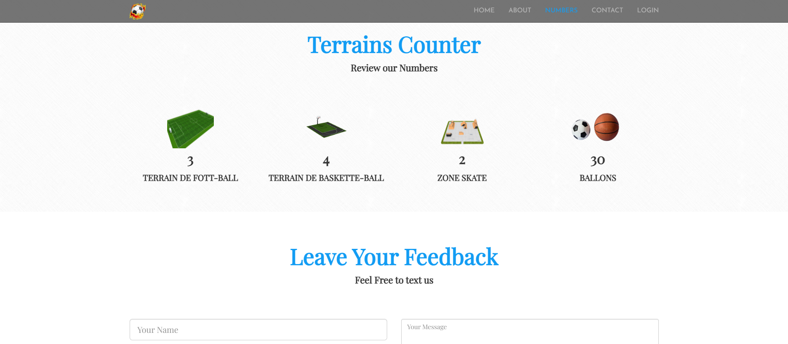
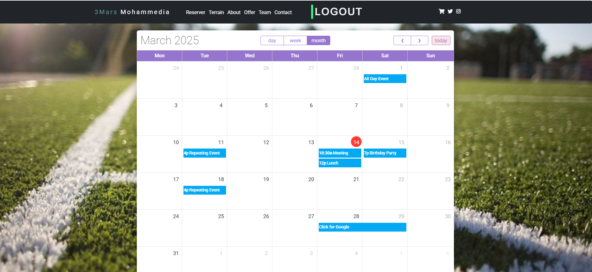

# ⚽ Réservation de Terrain


## 📌 Description
Bienvenue dans l'application de **Réservation de Terrain** ! Ce projet permet aux utilisateurs de réserver un terrain de sport en ligne, tout en offrant une interface d'administration pour gérer les réservations et les utilisateurs.

## 🚀 Fonctionnalités
✅ **Authentification et Autorisation** (Utilisateurs & Administrateurs)  
✅ **Réservation de terrains en ligne**  
✅ **Gestion des utilisateurs et des rôles**  
✅ **Système de flash messages pour les notifications**  
✅ **Gestion des sessions et de l'authentification avec Passport.js**  
✅ **Interface intuitive pour les utilisateurs et les administrateurs**  

## 🏗️ Technologies Utilisées
- **Backend** : Node.js, Express.js
- **Base de données** : MongoDB avec Mongoose
- **Authentification** : Passport.js (Local Strategy)
- **Moteur de templates** : EJS
- **Middleware** : Express-session, Connect-flash, Body-parser
- **Stockage des fichiers** : Multer

## 📂 Structure du Projet
```bash
📁 reservation-terrain
│── 📂 config
│   ├── database.js
│   ├── passport-setup.js
│── 📂 models
│   ├── User.js
│   ├── Match.js
│── 📂 routes
│   ├── user-routes.js
│   ├── match-routes.js
│── 📂 views
│   ├── user/
│   │   ├── authentification.ejs
│   ├── match/
│   │   ├── indexPage.ejs
│   │   ├── pageIndexUser.ejs
│   │   ├── pageIndexAdmin.ejs
│── 📂 public
│── 📂 uploads
│── 📜 server.js
│── 📜 package.json
│── 📜 README.md
```

## 🔧 Installation & Exécution
### 1️⃣ Prérequis
- [Node.js](https://nodejs.org/en/download/)
- [MongoDB](https://www.mongodb.com/try/download/community)

### 2️⃣ Installation
```bash
# Cloner le dépôt
git clone https://github.com/votre-utilisateur/reservation-terrain.git
cd reservation-terrain

# Installer les dépendances
npm install
```

### 3️⃣ Configuration
Créez un fichier `.env` à la racine et ajoutez vos configurations :
```env
PORT=3000
MONGO_URI=mongodb://localhost:27017/reservationDB
SESSION_SECRET=your_secret_key
```

### 4️⃣ Lancer l'application
```bash
npm start
```
L'application sera disponible sur **http://localhost:3000**

## 🎭 Rôles et Permissions
👤 **Utilisateur** : Peut s'inscrire, se connecter et réserver un terrain.  
👑 **Admin** : Peut gérer les réservations et voir tous les utilisateurs.  

## 🛠️ API Endpoints
| Méthode | Route | Description |
|---------|------------------|----------------------|
| GET | `/` | Redirection vers `/matches` |
| GET | `/users/login` | Page de connexion |
| POST | `/users/signup` | Inscription utilisateur |
| POST | `/users/login` | Connexion utilisateur |
| GET | `/users/logout` | Déconnexion |
| GET | `/matches` | Liste des matchs |
| GET | `/matches/pageIndex` | Interface utilisateur |
| GET | `/matches/pageIndexA` | Interface admin |

## 📸 Screenshots








## 🤝 Contribuer
Les contributions sont les bienvenues !
1. Forkez le projet 🍴
2. Créez une branche (`git checkout -b feature-amazing-feature`)
3. Commitez vos modifications (`git commit -m 'Add some amazing feature'`)
4. Poussez la branche (`git push origin feature-amazing-feature`)
5. Ouvrez une Pull Request 📩

## 📜 Licence
Ce projet est sous licence **MIT** 📄

---
💡 _Développé avec ❤️ par [Votre Nom](https://github.com/votre-utilisateur)_

